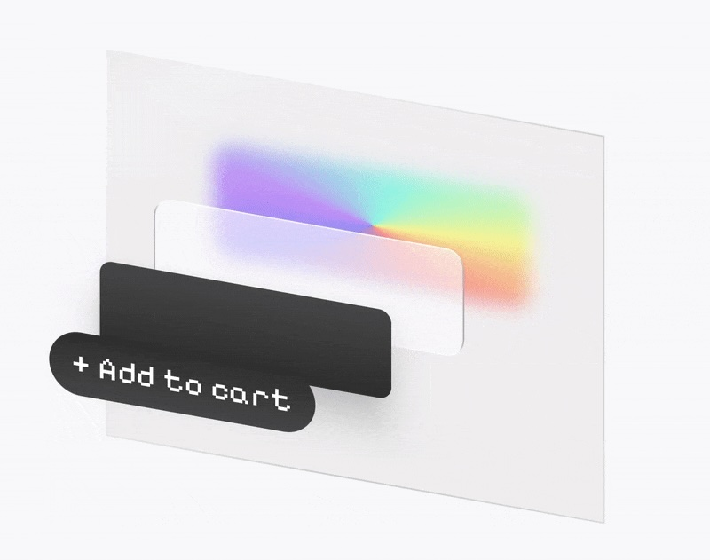

# 💣 Exploded Layers for Jetpack Compose

[](LICENSE)
[](https://kotlinlang.org)
[](https://developer.android.com/jetpack/compose)

Turn any composable into an **interactive “3D exploded view”**.

---

## ✨ Overview

`compose-exploded-layers` lets you visually **separate your UI into layers**, spaced along an offset
vector — rendering your composable tree in 3D space.

Use it to:

- Reveal structure or hierarchy within complex layouts
- Create dynamic visualizations for cards, lists, or photos
- Add depth to transitions, intros, or editor UIs

<p align="center">
  <picture>
    <source srcset="./assets/demo.gif" type="image/gif">
    
  </picture>
</p>

---

## 🚀 Features

✅ Animate between *collapsed* and *exploded* states  
✅ Draggable 2D exploration (pan and drag to rotate layers)  
✅ Customizable spread distance, easing, and axis  
✅ Lightweight — built only with Compose primitives  
✅ Works with any composable tree

---

## 📦 Installation

[](https://jitpack.io/#pingpongboss/compose-exploded-layers)

**Step 1.** Add the JitPack repository to your build file:

```kotlin
// settings.gradle.kts
dependencyResolutionManagement {
    repositoriesMode.set(RepositoriesMode.FAIL_ON_PROJECT_REPOS)
    repositories {
        mavenCentral()
        maven { url = uri("https://jitpack.io") }
    }
}
```

**Step 2.** Add the latest version of the dependency to your module’s build file:

```kotlin
// build.gradle.kts
dependencies {
    implementation("com.github.pingpongboss:compose-exploded-layers:<latest-version>")
}
````

*💡 Tip: Replace `<latest-version>` with the version shown on the badge above.*

*ℹ️ For more details, see [JitPack](https://jitpack.io/#pingpongboss/compose-exploded-layers)*.

---

## 📝 Basic Usage

```kotlin
@Composable
fun ExplodedLayersPreview() {
    val state = rememberExplodedLayersState()

    ExplodedLayersRoot(state) {
        Box(
            Modifier.background(Color.Red) // 1st layer.
                .separateLayer().background(Color.Blue) // 2nd layer.
        ) {
            SeparateLayer {
                Text("Hello world") // 3rd layer.
            }
        }
    }
}

```

---

## ⚙️ API Highlights

| Component                       | Description                                                                  |
|---------------------------------|------------------------------------------------------------------------------|
| `ExplodedLayersRoot()`          | Root container that applies 3D offset transforms to the layers nested within |
| `Modifier.separateLayer()`      | Modifier that marks everything after it as belonging to a separate layer     |
| `SeparateLayer()`               | Composable that marks its children as belonging to a separate layer          |
| `rememberExplodedLayersState()` | Composable factory to create and remember state                              |
| `ExplodedLayersState`           | Holds configuration and state (`offset`, `spread`, etc.)                     |

---

## ⚙️ Configurable Behaviors

`rememberExplodedLayersState()` and `ExplodedLayersState` exposes these configurable behaviors:

* `interactive` — Whether you can drag the exploded view to control its `offset`.
* `offset` — Direction of explosion (e.g., `DpOffset(x = -40.dp, y = 40.dp)`).
* `spread` — Controls how far layers separate (0f–1f).

---

## 🧪 Sample App

Check out the [`sample/`](sample) module for:

* Interactive explosion control via sliders
* Layer depth previews
* Examples of how to mark existing Composables with separate layers

Run it directly from Android Studio to explore how it works.

---

## 🤝 Contributing

Contributions welcome!
To get started:

1. Fork the repo
2. Create a new feature branch
3. Add your implementation + preview demo
4. Submit a Pull Request ✨

Please follow the existing code style and include KDoc for new public APIs.

---

## 🌐 Links

* 📘 **GitHub:**
  [pingpongboss/compose-exploded-layers](https://github.com/pingpongboss/compose-exploded-layers)
* 💬 **Issues / Feedback:**
  [Open an issue](https://github.com/pingpongboss/compose-exploded-layers/issues)
* 🧠 **Author:**
  [Mark Wei](https://www.linkedin.com/in/markwei/)

---

> *“Compose your UI — then explode it.”*