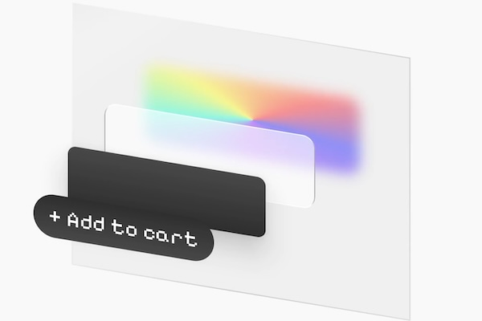

# 💣 Exploded Layers for Jetpack Compose

[](LICENSE)
[](https://kotlinlang.org)
[](https://developer.android.com/jetpack/compose)

Turn any composable into an **interactive “3D exploded view”**.

---

## ✨ Overview

`compose-exploded-layers` lets you visually **separate your UI into layers**, spaced along an offset
vector — rendering your composable tree in 3D space.

Use it to:

- Reveal structure or hierarchy within complex layouts
- Create dynamic visualizations for cards, lists, or photos
- Add depth to transitions, intros, or editor UIs

<p align="center">
  <picture>
    <source srcset="./assets/demo.gif" type="image/gif">
    
  </picture>
</p>

---

## 🚀 Features

✅ Animate between *collapsed* and *exploded* states  
✅ Draggable 2D exploration (pan and drag to rotate layers)  
✅ Customizable spread distance, easing, and axis  
✅ Lightweight — built only with Compose primitives  
✅ Works with any composable tree  
✅ Built with Kotlin Multiplatform (KMP), currently supporting Android and WebAssembly

---

## 📲 Sample Apps

[](https://github.com/pingpongboss/compose-exploded-layers/releases)

Try out the sample app to see exploded layers in action, and learn by example how to integrate with
the library.

###  Android

- **Download the latest APK** from
  the [release assets](https://github.com/pingpongboss/compose-exploded-layers/releases).
- **Build and install locally** using: `./gradlew :samples:android:installDebug` (you can also run
  the
  sample configuration directly from Android Studio.)
- Check-out the code under [`samples/android`](samples/android).

###  Web

- **Open the live demo** on the
  project's [Github Pages](https://pingpongboss.github.io/compose-exploded-layers/wasm-demo/).
- **Build and install locally** using: `./gradlew :samples:wasm:wasmJsBrowserDevelopmentRun`
- Check-out the code under [`samples/wasm`](samples/wasm).

---

## 📦 Library Integration

[](https://central.sonatype.com/artifact/io.github.pingpongboss/compose-exploded-layers)

**Step 1:** Ensure your Kotlin plugin versions are `2.2.20` or greater.

```toml
# libs.versions.toml
[versions]
kotlin = "2.2.20"

[plugins]
kotlin-android = { id = "org.jetbrains.kotlin.android", version.ref = "kotlin" }
kotlin-compose = { id = "org.jetbrains.kotlin.plugin.compose", version.ref = "kotlin" }
kotlin-multiplatform = { id = "org.jetbrains.kotlin.multiplatform", version.ref = "kotlin" }
```

**Step 2:** Add the latest version of the library to your module’s build file:

```kotlin
// build.gradle.kts
dependencies {
    implementation("io.github.pingpongboss:compose-exploded-layers:<latest-version>")
}
````

*💡 Tip: Replace `<latest-version>` with the latest version from the
library's [Maven Central page](https://central.sonatype.com/artifact/io.github.pingpongboss/compose-exploded-layers)*.

---

## 📝 Basic Usage

```kotlin
@Composable
fun MyCustomButton() {
    val state = rememberExplodedLayersState()

    ExplodedLayersRoot(state) {
        Box(
            Modifier.background(Color.Red) // Base layer.
                .separateLayer().background(Color.Blue) // Middle layer.
        ) {
            SeparateLayer { Text("Hello world") } // Top layer.
        }
    }
}

```

---

## ⚙️ API Highlights

| Component                       | Description                                                                  |
|---------------------------------|------------------------------------------------------------------------------|
| `ExplodedLayersRoot()`          | Root container that applies 3D offset transforms to the layers nested within |
| `Modifier.separateLayer()`      | Modifier that marks everything after it as belonging to a separate layer     |
| `SeparateLayer()`               | Composable that marks its children as belonging to a separate layer          |
| `rememberExplodedLayersState()` | Composable factory to create and remember state                              |
| `ExplodedLayersState`           | Holds configuration and state (`offset`, `spread`, etc.)                     |

---

## ⚙️ Configurable Behaviors

`rememberExplodedLayersState()` and `ExplodedLayersState` exposes these configurable behaviors:

* `interactive` — Whether you can drag the exploded view to control its `offset`.
* `offset` — Direction of explosion (e.g., `DpOffset(x = -40.dp, y = 40.dp)`).
* `spread` — Controls how far layers separate (0f–1f).

---

## 🤝 Contributing

Contributions welcome!
To get started:

1. Fork the repo
2. Create a new feature branch
3. Add your implementation and test with the sample app
4. Submit a Pull Request ✨

Please follow the existing code style and include KDoc for new public APIs.

### 👥 Contributors

If you are making a non-trivial contribution to the project, feel free to add your name to this
section.

* [Mark Wei](https://www.linkedin.com/in/markwei/): Authored the original library and Android sample
  app
* [sadellie](https://sadellie.github.io/): Added KMP support to the library.

---

## 🌐 Links

* 📘 **GitHub:**
  [pingpongboss/compose-exploded-layers](https://github.com/pingpongboss/compose-exploded-layers)
* 💬 **Issues / Feedback:**
  [Open an issue](https://github.com/pingpongboss/compose-exploded-layers/issues)
* 🧠 **Author:**
  [Mark Wei](https://www.linkedin.com/in/markwei/)
* ✨ **Inspiration:**
    * [Alvish Baldha - Keycap Button (Dribbble)](https://dribbble.com/shots/25117095)
    * [Clint Hess - Button Hover Effects (Dribbble)](https://dribbble.com/shots/25326661-Button-Hover-Effects)
    * [Syntax - CSS Challenge (Youtube)](https://www.youtube.com/watch?v=xtRx-aNrNe8)

---

> *“Compose your UI — then explode it.”*
